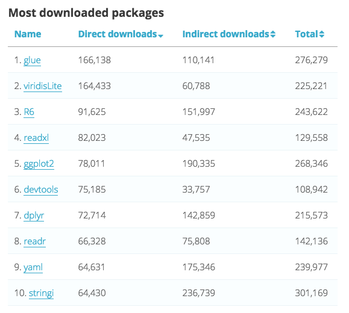

---
output:
  revealjs::revealjs_presentation:
    reveal_plugins: ["zoom"]
    self_contained: false
    incremental: false
    theme: "solarized"
    center: true
    smart: false
    includes:
      before_body: "footer.html"
---

---
<h2>Glue strings to data with </h2>

<p>Jim Hester </p>
<br />
<br />
<br />
`r icon::fa("twitter")` [\@jimhester_](https://twitter.com/jimhester_) <br />
`r icon::fa("github")` [\@jimhester](https://github.com/jimhester) <br />
`r icon::fa("envelope")` [jim.hester@rstudio.com](mailto:jim.hester@rstudio.com) <br />
<br />

## Gluing strings is everywhere

### Excel
```
=CONCATENATE(A1, " ", B1)
```
### Bash
```sh
dir=/tmp
for file in $dir/*; do
  cat $dir/$file
done
```

### python
```python
apples = 4
print("I have {a} apples".format(a=apples))

# Python 3.6+
print(f"I have {apples} apples")
```

## Gluing strings in R is painful

```{r setup0, include = F}
print.character <- function(x, ...) {
  cat(x)
  invisible(x)
}
library <- function(...) base::library(warn.conflicts = FALSE, ...)
library(dplyr)
library(glue)
```

```{r}
apples <- 3
bananas <- 2
paste0("Inventory", "\n",
"  Apples: ", apples, "\n",
"  Bananas: ", bananas, "\n",
"Total: ", apples + bananas)
  
sprintf("Inventory\n  Apples: %i\n  Bananas: %i\nTotal: %i",
  apples, bananas, apples + bananas)
```

```r
if (!file.exists(file)) {
  stop("'", file, "' not found")
}
```
## **glue** makes Gluing strings easy!

```{r, eval = require("glue")}
apples <- 3
bananas <- 2
glue("
  Inventory
    Apples: {apples}
    Bananas: {bananas}
  Total: {apples + bananas}")
```

## **glue** is for users

```{r}
library(dplyr)
mtcars %>%
  group_by(cyl) %>%
  summarize(
    description = glue("{avg} horsepower (sd={sd} n={n})",
                       
    avg = formatC(mean(hp),
                  digits = 2, format = "f"),
 
    sd = format(sd(hp),
                digits = 2),
    
    n = n()))
```

## **glue** is for packages

- Zero dependencies, Tested to R 3.1
- Customizable
- Fast

```{r, eval = FALSE}
abort <- function(..., .sep = "", .envir = parent.frame()) {
  stop(glue(..., .envir = .envir), call. = FALSE)
}

if (actual != expected) {
    abort("
      Expected content-type:
        * {expected}
      Actual content-type:
        * {actual}
      ")
}
```

# **glue** is customizable

## `.open` and `.close` change delimiters

```{r}
jlue <- function(..., .envir = parent.frame()) {
  glue(..., .open = "<", .close = ">", .envir = .envir)
}

apples <- 1; bananas <- 2
json <- jlue('
{
  "fruits": {
    "apples": <apples>,
    "bananas": <bananas>
  }
}')
jsonlite::fromJSON(json)
```

## `.transformer` are robust

```{r}
shell_transformer <- function(code, envir) {
  shQuote(eval(parse(text = code), envir))
}

glue_sh <- function(..., .envir = parent.frame()) {
  glue(..., .envir = .envir, .transformer = shell_transformer)
}

filename <- "test"
writeLines("hello!", filename)

cmd <- glue_sh("cat {filename}")
cmd
```

## `.transformer` are useful

```{r, include = FALSE}
sprintf_transformer <- function(code, envir) {
  m <- regexpr(":.+$", code)
  if (m != -1) {
    format <- substring(regmatches(code, m), 2)
    regmatches(code, m) <- ""
    res <- eval(parse(text = code), envir)
    do.call(sprintf, list(glue("%{format}f"), res))
  } else {
    eval(parse(text = code), envir)
  }
}

glue_fmt <- function(..., .envir = parent.frame()) {
  glue(..., .transformer = sprintf_transformer, .envir = .envir)
}
```
```{r}
glue_fmt("π: {pi:.7}")

ratio <- sum(mtcars$gear == 3) / nrow(mtcars)

glue_fmt("{ratio * 100:.2}% of mtcars have 3 gears")
```

## `.transformer` are fun 🎉

```{r, include = FALSE}
library(emo)
emoji_transformer <- function(code, envir) {
  if (grepl("[*]$", code)) {
    code <- sub("[*]$", "", code)
    glue_collapse(ji_find(code)$emoji)
  } else {
    ji(code)
  }
}

glue_ji <- function(..., .envir = parent.frame()) {
  glue(..., .open = ":", .close = ":", .envir = .envir, .transformer = emoji_transformer)
}
```

```{r}
glue_ji("If life gives you :lemon: make :tropical_drink:")

glue_ji("Many :hands*: make :light: :work:")
```

# **glue** is fast

## **glue** is fast on single strings

```r
bar <- "bar"
glue("foo{bar}")
```


## **glue** is fast on lots of strings

```r
bar <- rep("bar", 100000)
glue("foo{bar}")
```


## **glue** is fast

- `{` `}` parsing in C
- performance dominated by `parse()` `eval()` and `paste0()`.
- still slow? Vectorize!
- <https://glue.tidyverse.org/articles/speed.html>

# **glue** contains more than `glue()`

## `glue_data()` binds strings to any list / environment

```{r}
library(magrittr)
head(mtcars) %>% glue_data("{rownames(.)} has {cyl} cylinders and {hp}hp")
```

## `glue_collapse()` collapses vectors

```{r}
glue_collapse(1:10, sep = " ")
glue_collapse(1:10, sep = " ", width = 10)
glue_collapse(backtick(1:10), sep = ", ", last = " and ")
```

## `glue_sql()` quotes SQL strings
```{r}
con <- DBI::dbConnect(RSQLite::SQLite(), ":memory:")
tbl <- DBI::Id(schema = "xyz", table = "iris")
glue_sql("SELECT * FROM {`tbl`} WHERE species IN ({vals*})",
       vals = c("setosa", "versicolor"), .con = con)
```

# **glue** is popular???

----

<a href = "https://www.rdocumentation.org/trends"></a>

#### dplyr, stringr, tidyr dependency, maybe already installed

### Weekly downloads 

----

`install.packages("glue")`

[glue.tidyverse.org](https://glue.tidyverse.org)

```{r}
adjective <-  c("luminous", "stylish", "super", "striking",
                "impressive", "fantastic")

glue("Have a {sample(adjective, 1)} day!")
```
